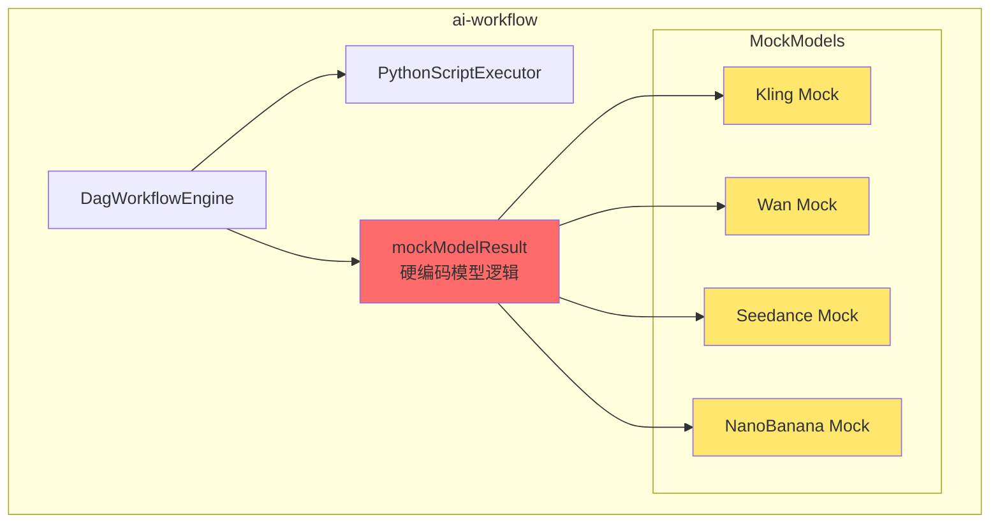
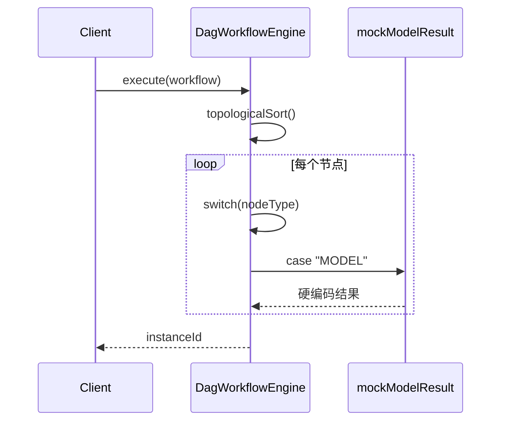
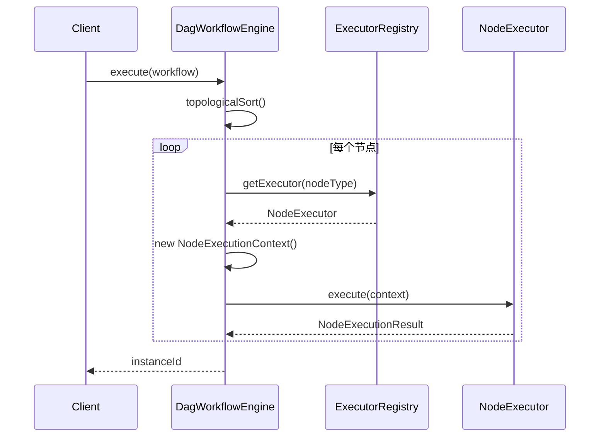
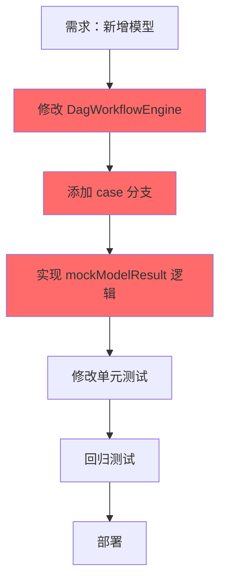
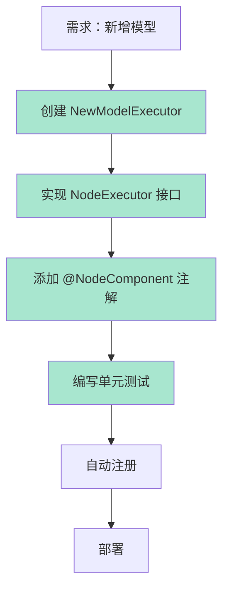
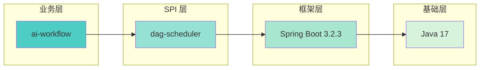
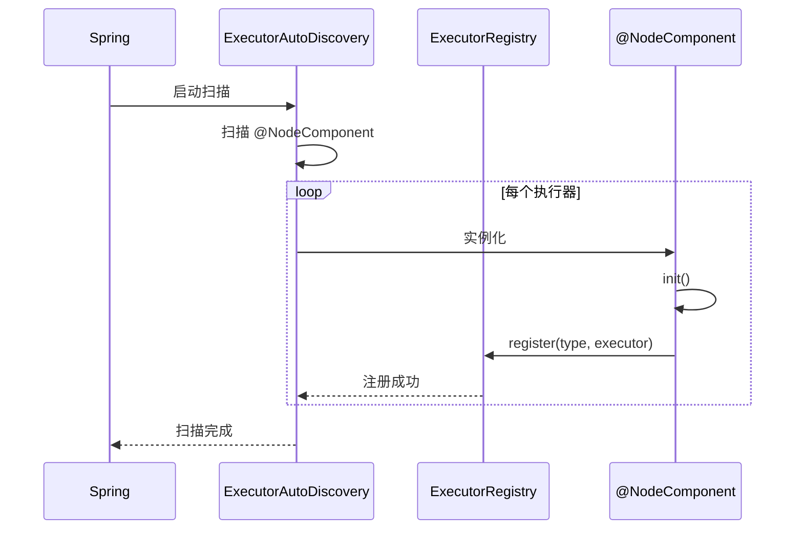
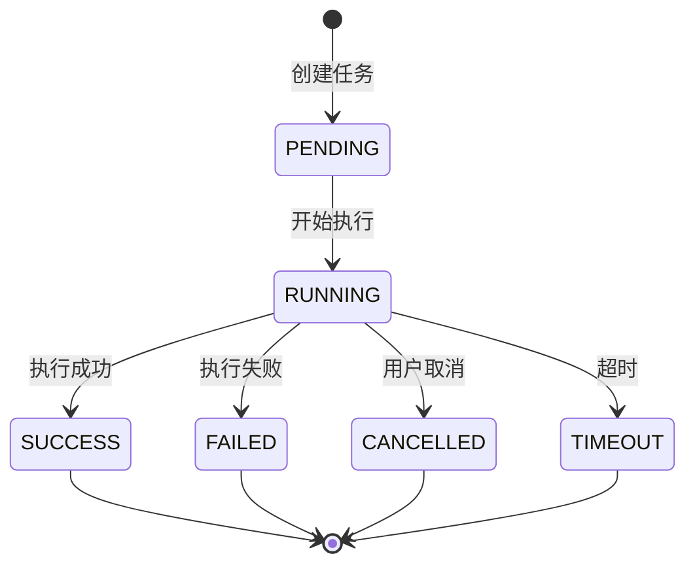

# 架构可视化

## 当前架构



**问题：**
- 🔴 模型逻辑硬编码在引擎中
- 🔴 新增模型需要修改引擎代码
- 🔴 无法运行时扩展
- 🟡 测试覆盖率低

---

## 重构后架构（方案 A）

```mermaid
graph TB
    subgraph ai-workflow["ai-workflow (业务层)"]
        Engine[DagWorkflowEngine]
        Registry[ExecutorRegistry<br/>SPI 注册中心]
        
        Engine --> Registry
    end
    
    subgraph dag-scheduler["dag-scheduler (SPI 框架)"]
        SPI[NodeExecutor 接口]
        
        subgraph Executors["执行器实现"]
            PyExec[PythonScriptExecutor]
            Kling[KlingExecutor]
            Wan[WanExecutor]
            Seedance[SeedanceExecutor]
            NanoBanana[NanoBananaExecutor]
        end
        
        SPI <|-- PyExec
        SPI <|-- Kling
        SPI <|-- Wan
        SPI <|-- Seedance
        SPI <|-- NanoBanana
        
        Registry --> PyExec
        Registry --> Kling
        Registry --> Wan
        Registry --> Seedance
        Registry --> NanoBanana
    end
    
    dag-scheduler -.->|依赖 | ai-workflow
    
    style Engine fill:#4ecdc4
    style Registry fill:#4ecdc4
    style SPI fill:#95e1d3
    style PyExec fill:#a8e6cf
    style Kling fill:#a8e6cf
    style Wan fill:#a8e6cf
    style Seedance fill:#a8e6cf
    style NanoBanana fill:#a8e6cf
```

**优势：**
- ✅ 统一 SPI 接口标准
- ✅ 新增模型无需修改引擎
- ✅ 支持运行时扩展
- ✅ 高测试覆盖率（95.7%）

---

## 数据流对比

### 当前：直接调用



### 重构后：SPI 调用



---

## 扩展流程对比

### 当前：添加新模型



**问题：** 需要修改核心引擎代码，风险高

---

### 重构后：添加新模型



**优势：** 新增文件，无需修改现有代码

---

## 模块依赖关系



**关键：** dag-scheduler 不依赖 ai-workflow，保持 SPI 层独立性

---

## 执行器注册流程



---

## 节点执行流程



---

*图表使用 Mermaid 语法，可在支持 Mermaid 的编辑器中查看*
